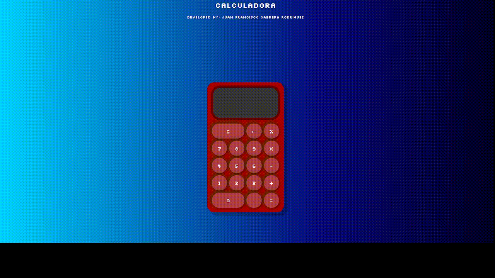

# Calculadora

- Calculadora

## 📒ÍNDICE

- [Calculadora](#calculadora)
  - [📒ÍNDICE](#índice)
  - [🔰 Acerca de](#-acerca-de)
  - [⚡ Uso](#-uso)
    - [🔌 Instalación](#-instalación)
    - [📦 Comandos](#-comandos)
  - [🔧 Desarrollo](#-desarrollo)
    - [📓 Requisitos previos](#-requisitos-previos)
    - [🔩 Entorno de desarrollo](#-entorno-de-desarrollo)
    - [📁 Estructura de archivos](#-estructura-de-archivos)
  - [📷 Galería](#-galería)
  - [🌟 Crédito/Reconocimiento](#-créditoreconocimiento)

## 🔰 Acerca de

Esta calculadora es mas complejas que el resto.

## ⚡ Uso

Para usar el proyecto solo tienes que habrir el index.html

### 🔌 Instalación

- No se requiere de ninguna instalación.

### 📦 Comandos

- No se requiere ningun comando.

## 🔧 Desarrollo

- En este proyecto no ha contribuido ninguna otra persona.

### 📓 Requisitos previos

Para poder llevar acabo este proyecto es necesario los siguientes conocimientos:

- HTML
- CSS
- JAVASCRIPT

### 🔩 Entorno de desarrollo

Para poder descargar el proyecto diríjase a Code > Download ZIP.

### 📁 Estructura de archivos

Agregue una estructura de archivos aquí con los detalles básicos sobre los archivos, a continuación se muestra un ejemplo.

La estructura de los archivos es la siguiente:

```r
.
├── 📁CALCULATOR-3D
│   ├── 📁css
│   │   └── style.css
│   │  
│   ├── 📁img
│   │   └── README-GIF.gif
│   │ 
│   ├── 📁js
│   │   ├── Calculadora.js
│   │   ├── Display.js
│   │   └── script.js
│   │  
│   └── index.html
│ 
└── README.md
```

## 📷 Galería



## 🌟 Crédito/Reconocimiento

Desarrollado por Juan Francisco Cabrera Rodríguez
